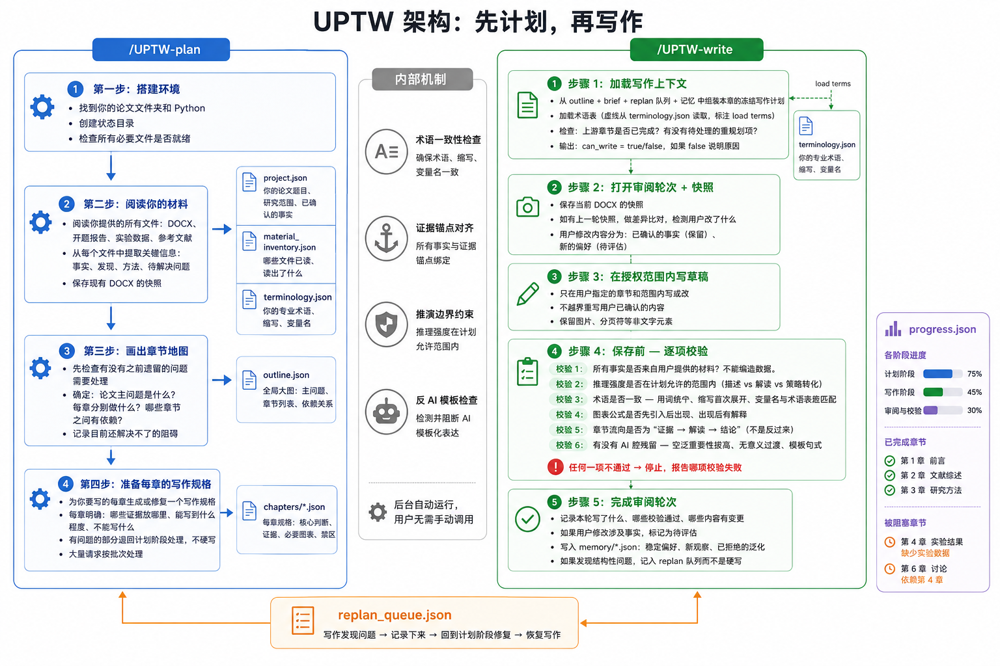

# UPTW

> 该技能不会被agent默认启用，需要时显式使用 `/UPTW-plan`、`/UPTW-write`

<p align="center">
  <strong>城市规划论文写作器</strong><br>
  <sub>一个把已完成的城市规划研究整理为十数万字的中文硕士学位论文 markdown 的持久技能。</sub><br>
  <sub>此版本写作规范和 docx 版本完全相同，只是不依赖 docx 工具，agent 操作更稳定，最终产出格式为 markdown（图片内容以链接形式存入 markdown）。如果你想直接使用 docx 以获得无需二次整理的成品，请见 <a href="https://github.com/LinX155/urban-planning-thesis-writer/tree/write_docx">write_docx 分支</a></sub>
</p>

---

## 这是什么

你可以使用各种数据分析与科研工作流来做你的研究、选题与实验，UPTW 只是一个长文写作框架：**在你已经完成研究、有了数据、图表和结论之后，把这些材料通过人机协作组织成一篇论证连贯、术语稳定、行文克制、语言得体的中文城市规划硕士论文。**

它解决的痛点不仅是  
<p align="center">
```请参考这个文件与结论帮我写一章没有AI味并使用城市规划术语的学术表达```  </p>
更是：

- 写作中证据链图表公式与论述是否一致
- 写到第 5 章时还记不记得第 3 章做了什么判断
- 用户改过的段落会不会被新一轮Agent写作覆盖.

UPTW 用一套持久化工件来解决这些问题：全局论证链、章节规格文件、写作上下文、审阅用户修改并形成记忆、结构冲突队列、快照与备份。

---

## 两个命令

| 命令 | 什么时候用 |
| --- | --- |
| `/UPTW-plan` | 0.首次使用时初始化论文工程的状态与记忆目录 1. 分析现有全部材料：锁定事实边界、建立论证关系、推荐每章定义核心判断和推演边界 2. 与你**一起讨论**行文框架与各章逻辑 |
| `/UPTW-write` | 1. 逐章或逐节写作；维持城乡规划中文学术写作要求，必要时阻断 2. 当你直接修改上轮markdown时，会记录修改内容并严格推理泛化边界、后台形成记忆|

正常顺序是 **plan（首次自动初始化） → write → write → …**，写作阶段发现阻塞时回到计划阶段修复。

---

## 使用方法

### 前提


- 实验、分析或实证处理已完成（或主体已完成）
- 主要发现和结论已存在于用户材料中
- 当前任务是组织成硕士论文 markdown


### 安装（目前仅限Windows）

如果你要安装这个 skill 包，推荐直接全局安装：

```powershell
npm install -g github:LinX155/urban-planning-thesis-writer#write_markdown
```

以上方式要求本机已安装 Node.js 和 python 3.10+。安装完成后，重启 Codex 或 Claude Code，即可使用：

- `/UPTW-plan`
- `/UPTW-write`


### 第一步：理解项目并建立计划

```
/UPTW-plan <prompt>
```

例如：

```
/UPTW-plan 请根据文件夹内的所有内容，帮我梳理一下我这个论文应该由哪些章节组成，给我各章节框架。  
/UPTW-plan 刚才我已经写好了第三章，现在我觉得第四章到第六章要重新详细制定一下子章节，给我框架。
```

准备好你的 markdown、图表、公式、实验输出和已确认结论。助手会：
- **首次使用**plan会在用户论文项目根目录下自动创建 `.urban-planning-thesis-writer/` 目录、安装 Python 依赖以应对复杂markdown的持续编辑、初始化所有状态文件。
- 阅读文件夹内的所有模态的文件并理解你的研究项目，串起证据链、开题报告与中期报告，给出一份章节结构设计
- 和你讨论每章的功能和核心判断并为每章定义推演边界（哪些判断只能描述、哪些可以谨慎解释、哪些能转译为策略）


人机讨论结果以文件形式固化在**你的项目文件夹**里，可执行、可校验，位置是：
- `.urban-planning-thesis-writer/state/project.json`：题目、研究对象、研究范围、当前 markdown、事实边界。
- `.urban-planning-thesis-writer/state/outline.json`：全局论证图、章节依赖、主问题、状态
- `.urban-planning-thesis-writer/state/chapters/*.json`：每个章节或小节的章节规格文件
- `.urban-planning-thesis-writer/state/replan_queue.json`：如果 plan 过程中发现需要修复的结构性冲突，会记录在这里  
这里的“结构冲突”指的是：它通常会在几种情况下产生：上游章节还没有产出却被下游依赖、现有证据不足以支撑原判断、用户修改推翻了既有依赖，或者某一节的实际写作目标已经明显偏离原章节规格。模型回提示你当前存在哪些冲突并讨论修复方案。

也就是说，计划阶段的关键结果会落盘到项目内，供后续write模式直接使用。


### 第二步：逐章写作与记忆校验

```
/UPTW-write <prompt>
```

例如：

```
/UPTW-write 继续写 3.2 小节，控制在 3000 字内，只允许修改这一节并保留前文已经确认的术语。
```

每次进入写作模式，只处理一个明确的章节或小节：

1. 从章节规格文件构建写作上下文，检查是否可以安全开写
2. 如果可以，快照 markdown 并开启本轮审阅轮次
3. 在授权范围内写作，保护用户已审阅的内容
4. 交付前检查产出是否满足章节规格中的核心判断和推演边界，并验证公式有无自然语言推导叙述、变量是否首次出现即解释、阈值是否附带含义、中文表达有无歧义

写作模式会先读取 `.urban-planning-thesis-writer/state/outline.json` 和对应的 `chapters/*.json`，生成本轮的 `.urban-planning-thesis-writer/state/current_write_context.json`，再据此写作和校验。也就是说，它读的是项目里已经固化的计划工件，不是只凭聊天上下文往下写。

如果写作过程中触发plan不够完备，助手会先停下来说明为什么现在不能继续写；你确认是补证据、降级判断还是调整结构，随后再回到 `/UPTW-plan` 修好之后继续 `/UPTW-write`。

每轮用户审阅后，再继续下一轮 `/UPTW-write`。

### 常见疑问


1. 如果你不是第一次 `/UPTW-plan` 就把所有章节一次谈完，也没关系。后续反复使用 `/UPTW-plan` 时，助手会继续更新同一份计划文件，

2. 如果你已经 `/UPTW-write` 了几轮，又回到 `/UPTW-plan` 调整章节结构，系统不会把前面的写作当作没发生。已写章节留下的 `confirmed_outputs`、审阅记录和结构冲突状态会继续保留。下一轮 `/UPTW-write` 会先读取更新后的计划工件，再决定是继续写、局部返工，还是先完成结构修复。

---

## 架构

UPTW 的重点是拆成 `plan -> write` 两个受约束的阶段。`/UPTW-plan` 冻结后的章节规格；`/UPTW-write` 只能在验证通过的上下文里按规格执行。

一旦上游结论失效、证据不足，或章节目标与原规格发生漂移，系统把问题写入 `replan_queue.json`，阻塞受影响的下游章节，再回到计划阶段统一修复。换句话说，plan管理的是整篇论文的论证秩序。




---

### 工件体系

```
.urban-planning-thesis-writer/
  state/
    project.json          ← 论文题目、研究对象、范围、事实边界
    outline.json          ← 全局论证图：主问题、章节功能、依赖关系
    chapters/             ← 每章规格：核心判断、推演模式、证据锚点、公式自然语言推导描述
    replan_queue.json     ← 待修复的结构性冲突
    terminology.json      ← 术语、缩写、变量命名
    material_inventory.json ← 材料盘点、已深读/暂缓材料、提取出的证据线索。
    progress.json         ← 完成进度与阻塞状态
    memory/
      user_revision_preferences.json  ← 你反复验证过的写作偏好
      section_memory.json             ← 按章节累计的确认事实
    backups/             ← markdown 原文件备份（安全第一）
```

<small style="color: #888">以下工件由系统自动维护，正常使用无需关心：</small>

<small style="color: #888">

```
      current_write_context.json  ← 最新写作上下文（覆盖式）
      review-cycles/              ← 每轮写作的 request + completion
        review_history.jsonl      ← 审阅事件日志（含差异摘要）
      snapshots/                  ← markdown 文本快照
    logs/                         ← 写入和审查日志
```

</small>

## 参考文件体系

`references/` 目录下的这些文件各司其职：

| 文件 | 应用的阶段 | 回答什么问题 |
| --- | --- | --- |
| `skill-contract.md` | Plan + Write | 两个个 skill 共用的总约束、适用边界和返回风格 |
| `state-schema.md` | Plan + Write | 所有状态文件的字段定义 |
| `artifact-workflow.md` | Plan + Write | 工件设计理念和各工件的结构说明 |
| `chapter-evidence-alignment.md` | Plan + Write | 有没有证据支撑、能不能开写 |
| `inference-boundaries.md` | Plan + Write | 有了证据之后，推演可以写到多强（5 级推演模式） |
| `writing-standards.md` | Plan + Write | 从证据到文字的最终硬约束 |
| `chapter-function-bank.md` | Plan + Write | 每类章节的功能、常见论证动作和不推荐写法 |
| `rubric.md` | Plan + Write | 这个 skill 自己有没有跑偏 |
| `corpus-findings.md` | Plan | 从真实城市规划硕士论文中观察到了什么共性 |
| `harness-design.md` | Plan | 长文写作框架的设计原则来源 |
| `anti-template-patterns.md` | Write | 10 种具体 AI 腔模式：空泛导语、重要性拔高、无来源权威句、抽象名词堆叠…… |
| `reverse-outlining.md` | Write | 写散了、写长了、前后跳了怎么修结构 |
| `red-line-review.md` | Write | 接近定稿时只抓硬伤，不制造噪音 |

这些文件的分工遵循一个原则：**每个文件只回答一个问题，不越界。** 比如"能不能写"由 `chapter-evidence-alignment.md` 回答，"能写到多强"由 `inference-boundaries.md` 回答，"写出来应该是什么样"由 `writing-standards.md` 回答。

---

## 设计原则

**证据优先。** 现有 markdown、图表、公式、数据输出和用户确认的结论，优先级永远高于对话中产生的推断。

**工件优先。** 把关键决策落成磁盘上的结构化文件。这样会话中断、上下文压缩、多线并行都不会丢失论证上下文。

**人机协作记忆。** 只有被反复验证的偏好、术语和事实才进入长期记忆。一次性润色不自动泛化，如果不确定是否计入记忆，会要求用户审批。

**冲突先回计划。** 依赖缺失、证据不足或主线漂移不在写作阶段临场补丁，会写入结构冲突队列并提示回到计划阶段修复。

**推导思路自然语言化。** 涉及公式或计算时，先用自然语言叙述推导逻辑，再以公式精确化表达。变量符号按需使用，简单量优先用中文描述。不应为了"学术风格"而将表达刻意复杂化。


### 硬边界

- 不编造数据、结果、引文、图表含义、公式解释、空间发现或政策推论
- 不把一次性局部修改泛化成全局写作规则
- 不越过授权范围重写已审阅内容
- 不在写作阶段静默修正结构性冲突，必须先回到计划阶段修复
- 不依赖 bash——Windows 优先，PowerShell + Python 脚本
- 公式首次出现的变量必须解释含义；文内公式以括号说明，换行公式另起一行逐一解释
- 出现阈值时必须附带含义解释和取值理由
- 检查中文表达是否存在歧义，确保每种表述只有一种理解方式

---

## 许可与致谢

本技能的设计受 OpenSpec 的工件驱动思路和  
https://github.com/Leey21/awesome-ai-research-writing  
https://github.com/Master-cai/Research-Paper-Writing-Skills  
https://github.com/blader/humanizer  
写作技能体系启发。  
三十余篇语料参考来自知网公开可下载的精选的近三年211以上大学**城市规划专业实证研究型**硕士论文，仅用于凝练共同写作规律，** 不包含 **任何可复制的论文原文。
